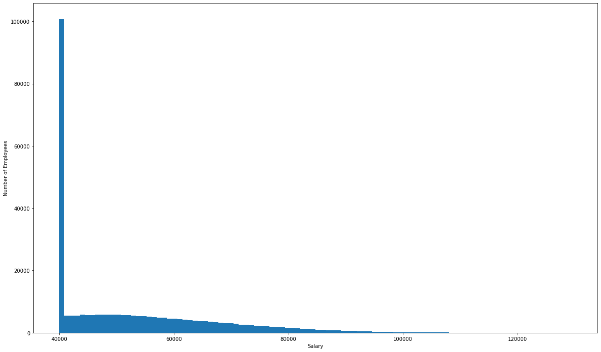
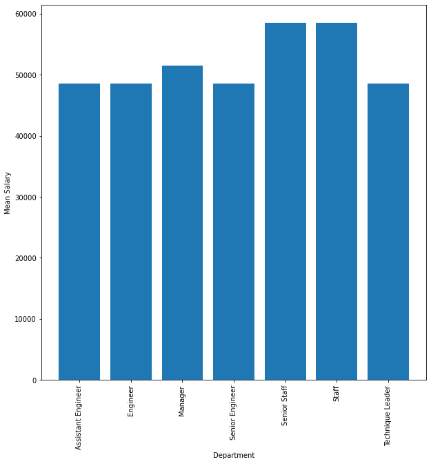

# sql-challenge
### Robert Lane

## How to Run

Within the EmployeeSQL folder are 3 .SQL files.  The first, **create_tables.sql** , is a manually-created query to setup database tables which match the CSV files within the **/data** folder.  The problem with this method of execution is that the data must be imported in a specific order - namely, tables which do not have foreign keys must be filled prior to other tables.

To rectify that problem (and to simplify data importation), run **QuickDBD-export.sql** .  Having run this, I am convinced that this is a prefered method of setting up a new database, because it not only allows me to visualize the data, it also allows me to export a query which sets up the tables.  Even better, it names the tables before linking foreign keys to primary keys.  

1. Run the *CREATE TABLE* statements.  
2. Import the data into the corresponding tables by the same name.  
3. Run the *ALTER TABLE* statements to link keys.

Questions asked are answered within the **query.sql** file.

Further analysis is included with **Alchemy.ipynb**, using Jupyter Notebook.  The summary of this analysis is included below for easier viewing.

## Results  
*limiting results to 5 each to reduce length of report*  
#### 1. List the following details of each employee: employee number, last name, first name, sex, and salary.  

| emp_no | last_name   | first_name  | sex | salary |
|--------|-------------|-------------|-----|--------|
| 10005  | "Maliniak"  | "Kyoichi"   | "M" | 78228  |
| 10010  | "Piveteau"  | "Duangkaew" | "F" | 72488  |
| 10011  | "Sluis"     | "Mary"      | "F" | 42365  |
| 10013  | "Terkki"    | "Eberhardt" | "M" | 40000  |
| 10017  | "Bouloucos" | "Cristinel" | "F" | 71380  |

#### 2. List first name, last name, and hire date for employees who were hired in 1986.

| **first_name** | **last_name** | **hire_date** |
|----------------|---------------|---------------|
| "Jiann"        | "Bondorf"     | "1986-01-01"  |
| "Holgard"      | "Prenel"      | "1986-01-01"  |
| "Hercules"     | "Veevers"     | "1986-01-01"  |
| "Achilleas"    | "Kroft"       | "1986-01-01"  |
| "Unal"         | "Cooley"      | "1986-01-01"  |

#### 3. List the manager of each department with the following information: department number, department name, the manager's employee number, last name, first name.

| **dept_no** | **dept_name**     | **emp_no** | **last_name**  | **first_name** |
|-------------|-------------------|------------|----------------|----------------|
| "d001"      | "Marketing"       | 110022     | "Markovitch"   | "Margareta"    |
| "d001"      | "Marketing"       | 110039     | "Minakawa"     | "Vishwani"     |
| "d002"      | "Finance"         | 110085     | "Alpin"        | "Ebru"         |
| "d002"      | "Finance"         | 110114     | "Legleitner"   | "Isamu"        |
| "d003"      | "Human Resources" | 110183     | "Ossenbruggen" | "Shirish"      |

#### 4. List the department of each employee with the following information: employee number, last name, first name, and department name.

| **emp_no** | **last_name** | **first_name** | **dept_name**     |
|------------|---------------|----------------|-------------------|
| 10001      | "Facello"     | "Georgi"       | "Development"     |
| 10002      | "Simmel"      | "Bezalel"      | "Sales"           |
| 10003      | "Bamford"     | "Parto"        | "Production"      |
| 10004      | "Koblick"     | "Chirstian"    | "Production"      |
| 10005      | "Maliniak"    | "Kyoichi"      | "Human Resources" |

#### 5. List first name, last name, and sex for employees whose first name is "Hercules" and last names begin with "B."

| **first_name** | **last_name** | **sex** |
|----------------|----------------|---------|
| "Hercules"     | "Baer"         | "M"     |
| "Hercules"     | "Biron"        | "F"     |
| "Hercules"     | "Birge"        | "F"     |
| "Hercules"     | "Berstel"      | "F"     |
| "Hercules"     | "Bernatsky"    | "M"     |

#### 6. List all employees in the Sales department, including their employee number, last name, first name, and department name.

| **emp_no** | **last_name** | **first_name** | **dept_name** |
|------------|---------------|----------------|---------------|
| 455773     | "Aamodt"      | "Aemilian"     | "Sales"       |
| 107094     | "Aamodt"      | "Baoqiu"       | "Sales"       |
| 203802     | "Aamodt"      | "Berry"        | "Sales"       |
| 428594     | "Aamodt"      | "Breannda"     | "Sales"       |
| 61219      | "Aamodt"      | "Chuanyi"      | "Sales"       |

#### 7. List all employees in the Sales and Development departments, including their employee number, last name, first name, and department name.

| emp_no | last_name | first_name   | dept_name     |
|--------|-----------|--------------|---------------|
| 258641 | "Aamodt"  | "Abdelkader" | "Development" |
| 258005 | "Aamodt"  | "Adhemar"    | "Development" |
| 455773 | "Aamodt"  | "Aemilian"   | "Sales"       |
| 436560 | "Aamodt"  | "Alagu"      | "Development" |
| 15427  | "Aamodt"  | "Aluzio"     | "Development" |

#### 8. List the frequency count of employee last names (i.e., how many employees share each last name) in descending order.

| **last_name** | **frequency** |
|---------------|---------------|
| "Baba"        | 226           |
| "Gelosh"      | 223           |
| "Coorg"       | 223           |
| "Sudbeck"     | 222           |
| "Farris"      | 222           |

## Further Analysis
Below is a histogram which shows salaries for all employees within 100 bins.  This is clearly not a normal type of distribution; most of the salaries seem to be about $40,000 to 50,000.  This indicates that the seed data may not be real data.

    

Below is average salary by department.  What's notable here is that Engineers make the same average salary, no matter whether they are an Assistant Engineer, an Engineer, or a Senior Engineer.  This again demonstrates that the data is likely falsified intentionally.

